# LayeredLayouts [](https://github.com/oxinabox/LayeredLayouts.jl/actions) [](https://coveralls.io/github/oxinabox/LayeredLayouts.jl?branch=master)


LayeredLayouts is a package for working out how to layout graphs in a layered fashion.
In particular for how to layout directed acyclic graphs (DAGs), including trees, dependency graphs, and sankey diagrams.
It is not a package for actually visualizing graphs, rather it is a suitable helper for those to use.
It is a lot like [NetworkLayout.jl](https://github.com/JuliaGraphs/NetworkLayout.jl).

Presently it has one algorithm:
`Zarate`, based on
[D. C. Zarate, P. L. Bodic, T. Dwyer, G. Gange and P. Stuckey, "Optimal Sankey Diagrams Via Integer Programming," _2018 IEEE Pacific Visualization Symposium (PacificVis)_, Kobe, 2018, pp. 135-139, doi: 10.1109/PacificVis.2018.00025.](https://ialab.it.monash.edu/~dwyer/papers/optimal-sankey-diagrams.pdf).
Which is a Sugiyama style layout algorthm via full mixed integer programming.


### Usage
```julia
julia> using LayeredLayouts, Graphs

julia> tiny_depgraph = SimpleDiGraph(Edge.([
           1 => 2;
           2 .=> [4, 5, 6];
           3 .=> [2, 4, 5, 6, 7, 8];
           4 .=> [9, 10, 11];
       ]))
{11, 13} directed simple Int64 graph

julia> xs, ys, paths = solve_positions(Zarate(), tiny_depgraph);

julia> xs, ys
([1.0, 2.0, 1.0, 3.0, 3.0, 3.0, 2.0, 2.0, 4.0, 4.0, 4.0], [-0.500000683006983, -0.9285709647225431, 0.500000681452564, 0.40476260792712027, -0.5952375840605986, -1.5952379163280372, 3.0714291353124143, 2.0714290900138614, 1.404762745121713, 0.4047626078228009, -0.5952375294761111])

julia> paths
Dict{Graphs.SimpleGraphs.SimpleEdge{Int64},Tuple{Array{Float64,1},Array{Float64,1}}} with 13 entries:
  Edge 2 => 5  => ([2.0, 3.0], [-0.928571, -0.595238])
  Edge 3 => 8  => ([1.0, 2.0], [0.500001, 2.07143])
  Edge 3 => 5  => ([1.0, 2.0, 3.0], [0.500001, 0.0714291, -0.595238])
  Edge 4 => 11 => ([3.0, 4.0], [0.404763, -0.595238])
  Edge 3 => 2  => ([1.0, 2.0], [0.500001, -0.928571])
  Edge 4 => 10 => ([3.0, 4.0], [0.404763, 0.404763])
  Edge 3 => 4  => ([1.0, 2.0, 3.0], [0.500001, 1.07143, 0.404763])
  Edge 3 => 7  => ([1.0, 2.0], [0.500001, 3.07143])
  Edge 2 => 4  => ([2.0, 3.0], [-0.928571, 0.404763])
  Edge 1 => 2  => ([1.0, 2.0], [-0.500001, -0.928571])
  Edge 2 => 6  => ([2.0, 3.0], [-0.928571, -1.59524])
  Edge 3 => 6  => ([1.0, 2.0, 3.0], [0.500001, -1.92857, -1.59524])
  Edge 4 => 9  => ([3.0, 4.0], [0.404763, 1.40476])
```

### Gallery
This plots are from the examples in
[test/examples.jl](test/examples.jl), plotted via script in [test/demos.jl](test/demos.jl).

As you can see in the first plot below, pathing though the dummy nodes actually guarantees minimal number of crossings.
On the _tiny_depgaph_ example direct has 3 crossings, where as path through dummy node only 2).
However, it also doesn't actually always look as nice.
It might look nicer if you used some swishy Bezier curves though (Plots.jl has a [curves attribute](http://docs.juliaplots.org/latest/generated/graph_attributes/), and a matching function, which does this)
We leave that to the visualization library.

| Direct | Path though dummy nodes |
|---     |---                      |
| 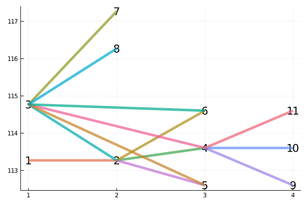 | 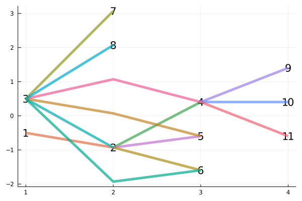 |
| 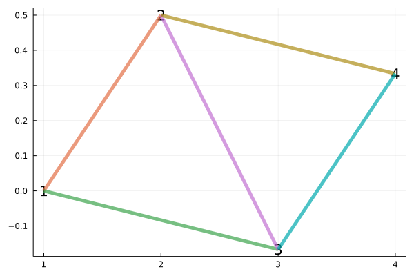 | 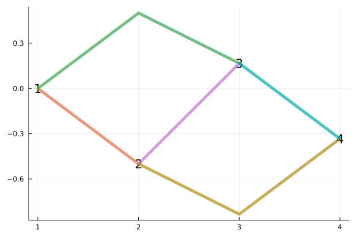 |
| 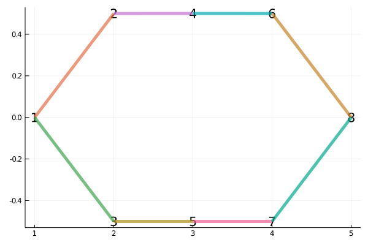 | 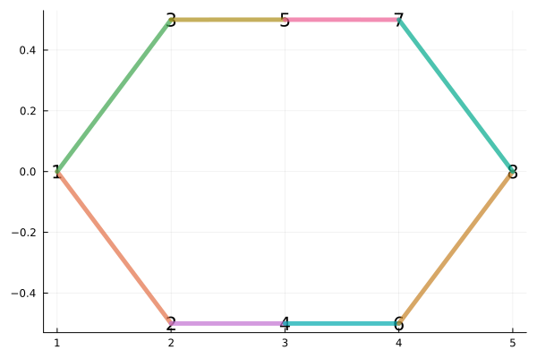 |
| 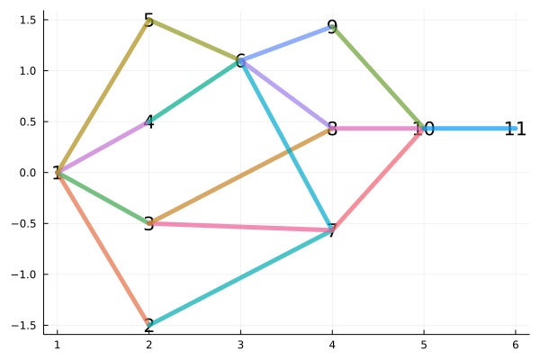 | 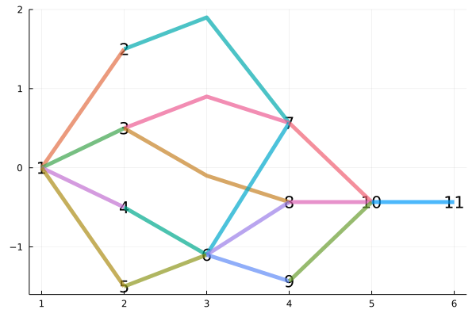 |
| 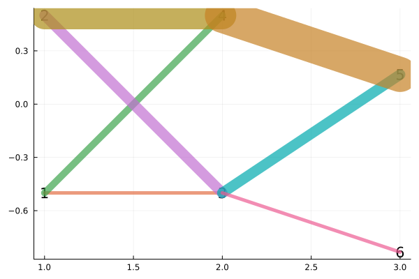 |  |
| 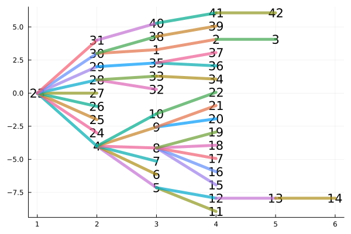 |  |
| 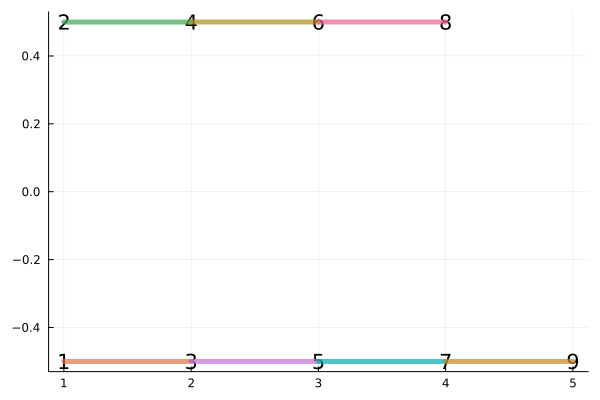 | 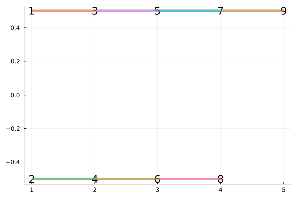 |
| 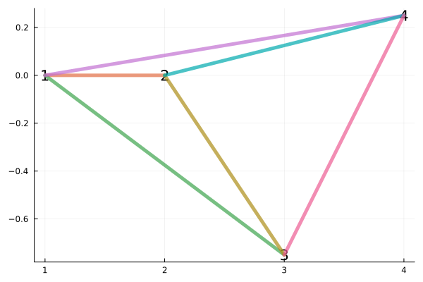 | 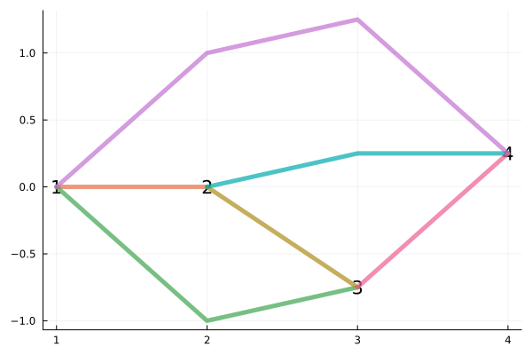 |
